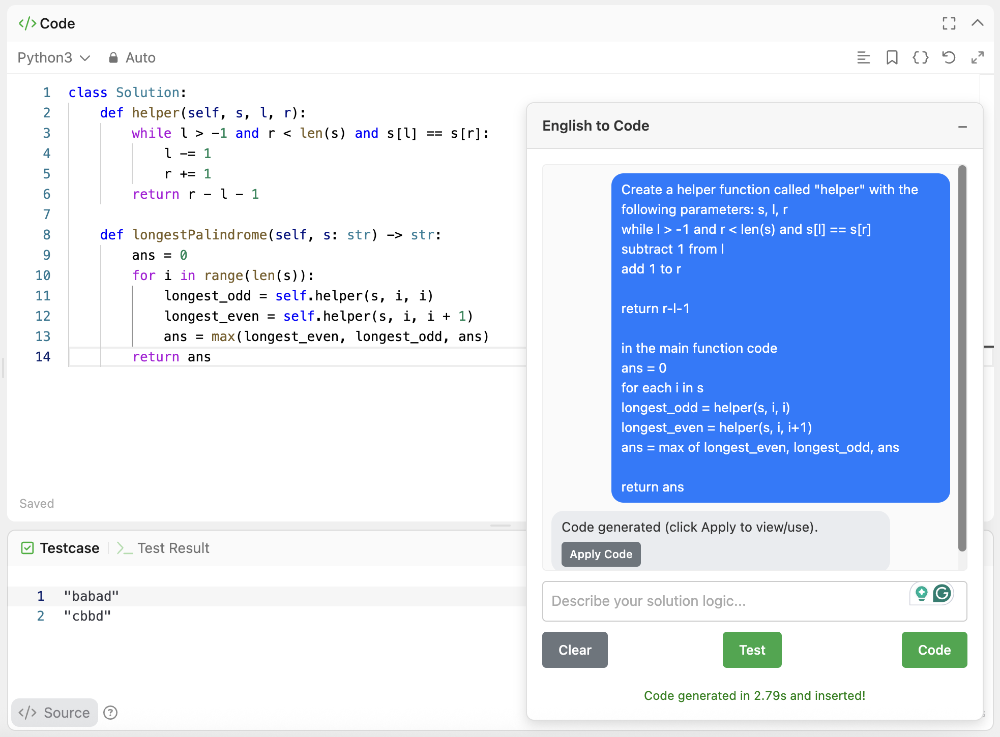
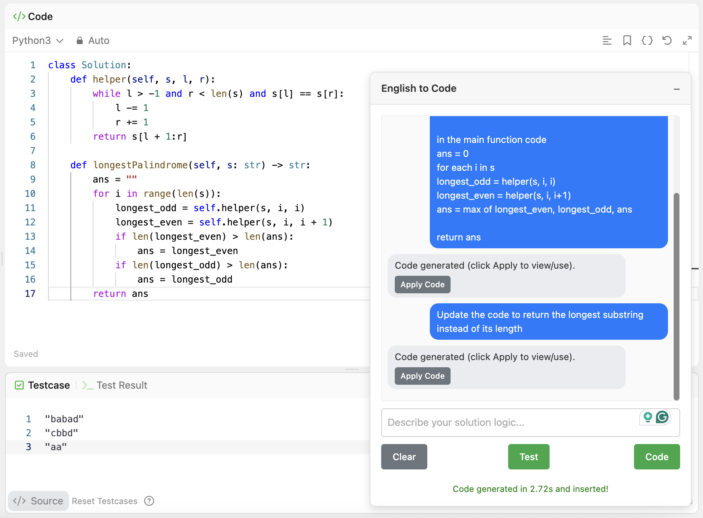
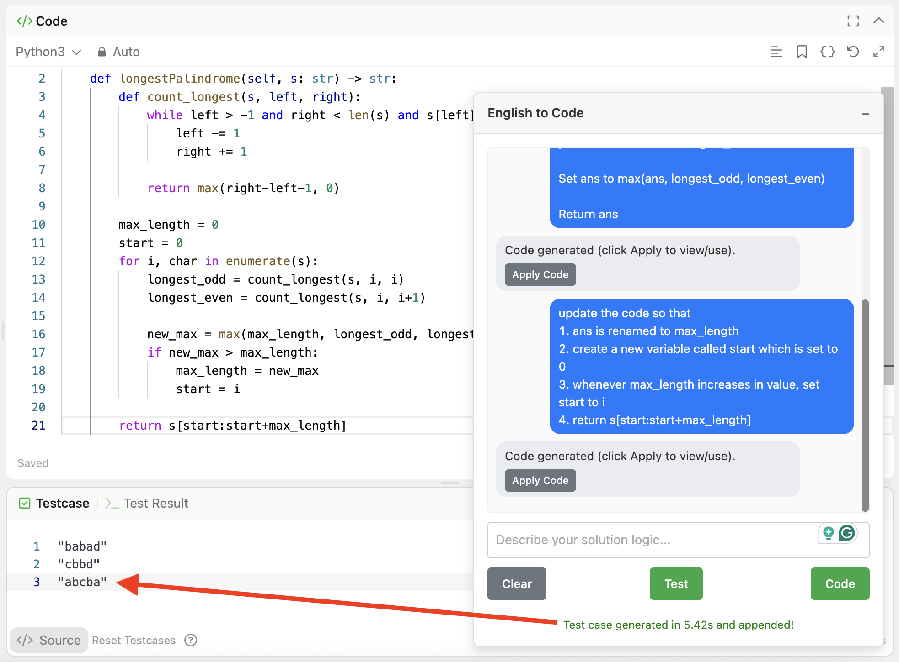
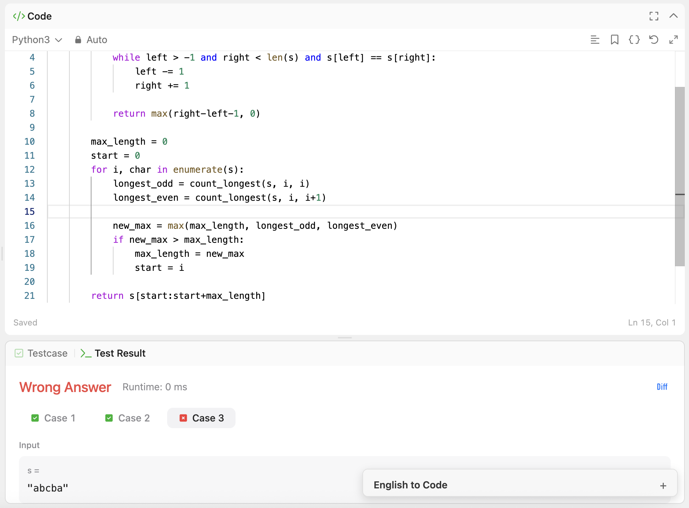
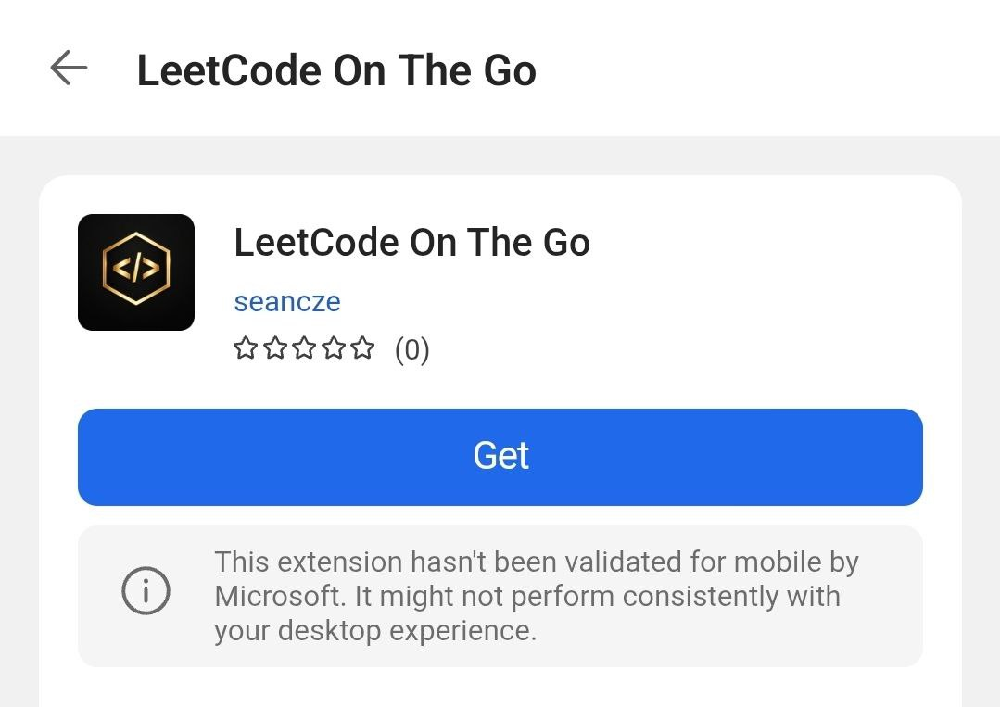

# LeetCode On The Go

Coding on mobile is hard because it is difficult to code with proper indentations and punctuations. This browser extension allows you to **LeetCode on mobile by writing solutions in English**.

## Features

- **Natural Language to Code**: Describe your logic in English, get Python code.
  
- **Chat History**: Maintains a conversation history per problem so you can refine your solution iteratively.
  
- **Test Case Generation**: Evaluates your existing code snippet. If the logic appears incorrect, it generates a single failing test case to help you debug.
  
  

## Installation

### Mobile

Google Chrome does **not** support extensions on mobile. To use this extension on Mobile, download Microsoft Edge:

- [Google Play Store](https://play.google.com/store/apps/details?id=com.microsoft.emmx)
- [Apple App Store](https://apps.apple.com/us/app/microsoft-edge-ai-browser/id1288723196)

Then, copy the link below into your mobile browser:
https://microsoftedge.microsoft.com/addons/detail/leetcode-on-the-go/gekpombcbbhihahgepkfkcfkgiihmjhc

Finally, click "Get" to install the extension:


### Desktop

If you would like to use this extension on desktop, you may continue to install the extension on the Chrome Web Store:
https://chromewebstore.google.com/detail/leetcode-on-the-go/omolmbaihkobpnhnbjjcipipndhchpma

## Usage

1.  Navigate to any LeetCode problem page. For example: https://leetcode.com/problems/two-sum/
2.  A floating panel will appear in the bottom right.
3.  Select the "Python3" language for your code editor.
4.  Type your solution logic in the text area.
    - Example: "Create a hash map to store the complement of each number. Iterate through the array, check if complement exists, if so return indices."
5.  Click **Code**.
6.  The extension will generate the Python code and replace the content in the LeetCode editor.
7.  You can continue the conversation to fix bugs or optimise the solution.

## For developers

### Install local copy

1.  Clone or download this repository.
2.  Build the repository: `npm run build`
3.  Open Chrome and navigate to `chrome://extensions/`.
4.  Enable **Developer mode** in the top right corner.
5.  Click **Load unpacked**.
6.  Select the `dist/src/` folder

## Running tests

### Code generation

```bash
npx promptfoo@0.119.14 eval -c promptfoo/code/promptfooconfig.yaml --no-cache
```

### Test generation

```bash
npx promptfoo@0.119.14 eval -c promptfoo/test/promptfooconfig.yaml --no-cache
```

### View logs

Add a `--verbose` flag. For example,

```bash
npx promptfoo@0.119.14 eval -c promptfoo/code/promptfooconfig.yaml --no-cache --verbose
```

### View results in browser

```bash
npx promptfoo@0.119.14 view
```
